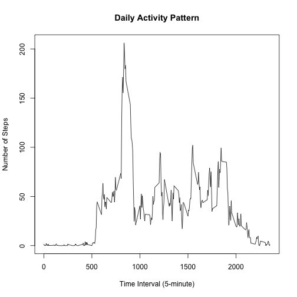
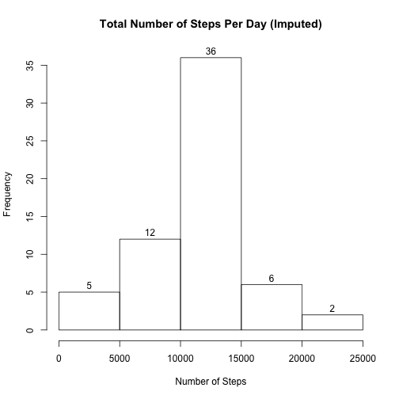
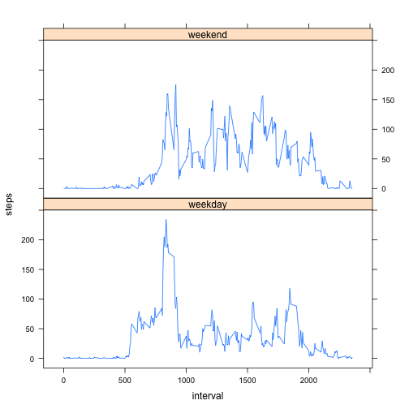

Reproducible Research: Peer Assessment 1
================================================================================

## Introduction
The assignment uses data from a personal activity monitoring device. The data set covers two months (October and November 2012) of activity data collected at 5-minute intervals throughout the day from an anonymous individual. 

The zipped file `activity.zip`, is assumed to be present in the directory and contain the data file `activity.csv`.

To make sure that the code run is visible, the options are set here:

```r
opts_chunk$set(echo = TRUE, results = "markup")
```


## Loading and preprocessing the data

1. Unzip the compressed data file `activity.zip`.
2. Load the csv file `activity.csv`.
3. Convert the date field from string into "Date" class.


```r
unzip("activity.zip")
data <- read.csv("activity.csv")
time <- Sys.time()
nrows <- format(nrow(data), big.mark = ",")
ndays <- length(unique(data$date))
names <- names(data)
data$date <- as.Date(data$date)
```

The data set was loaded at 2014-10-14 05:29:01. It consists of 17,568 rows corresponding to 61 days and the following fields: steps, date, interval.


## What is mean total number of steps taken per day?

1. Calculate the total number of steps taken each day.
2. Make a histogram of the total number of steps taken each day.
3. Calculate the mean and median total number of steps taken each day.


```r
daily_steps <- aggregate(data$steps, by = list(data$date), FUN = sum)
names(daily_steps) <- c("date", "steps")
invalid_dates <- daily_steps[is.na(daily_steps$steps), "date"]
nvalid_dates <- nrow(daily_steps) - length(invalid_dates)
hist(daily_steps$steps, main = "Total Number of Steps Per Day",
     xlab = "Number of Steps", labels = TRUE)
```

 

```r
mean_steps <- format(mean(daily_steps$steps, na.rm = TRUE),
                     nsmall = 2, big.mark = ",")
median_steps <- format(median(daily_steps$steps, na.rm = TRUE), big.mark = ",")
```

The missing values (coded as `NA`) are ignored here and interpreted to mean that no measurements were taken (as opposed to step count being 0). The following dates do not have any valid data: 2012-10-01, 2012-10-08, 2012-11-01, 2012-11-04, 2012-11-09, 2012-11-10, 2012-11-14, 2012-11-30. Hence the histogram only represents the 53 dates in the dataset that had at least one valid (not `NA`) value.  When considering only those dates:
- **mean** total number of steps taken per day is 10,766.19.
- **median** total number of steps taken per day is 10,765.


## What is the average daily activity pattern?

1. Calculate the mean (across all days) number of steps taken for each 5-minute interval.
2. Make a time series plot of 5-minute interval and mean number of steps taken (i.e. plot numbers calculated in step 1).
3. Identify which time interval had the largest number of steps on average. 


```r
pattern <- aggregate(data$steps, by = list(data$interval), FUN = mean,
                     na.rm = TRUE)
names(pattern) <- c("interval", "steps")
plot(pattern$interval, pattern$steps, type = "l",
     main = "Daily Activity Pattern", xlab = "Time Interval (5-minute)",
     ylab = "Number of Steps")
```

 

```r
max_steps <- max(pattern$steps)
interval_max_steps <- pattern[pattern$steps == max_steps, "interval"]
interval_hour <- floor(interval_max_steps / 100)
interval_min <- interval_max_steps %% 100
```

The 5-minute interval with the largest number of steps on average was interval 835 (i.e. period beginning at 8:35). 


## Imputing missing values

1. Calculate the total number of missing values in the dataset.
2. Devise a strategy for filling in the missing values.
3. Create a new dataset with the missing values filled in (using the strategy identified in step 2).
4. 


```r
nrows_na <- format(sum(is.na(data$steps)), big.mark = ",")
merged <- merge(data, pattern, by = "interval")
merged[is.na(merged$steps.x), "steps.x"] <- merged[is.na(merged$steps.x), "steps.y"]
data_filled <- merged[, 1:3]
names(data_filled) <- c("interval", "steps", "date")
filled_steps <- aggregate(data_filled$steps, by = list(data_filled$date),
                          FUN = sum)
names(filled_steps) <- c("date", "steps")
hist(filled_steps$steps, main = "Total Number of Steps Per Day (Imputed)",
     xlab = "Number of Steps", labels = TRUE)
```

 

```r
mean_filled_steps <- format(mean(filled_steps$steps, na.rm = TRUE),
                            nsmall = 2, big.mark = ",")
median_filled_steps <- format(median(filled_steps$steps, na.rm = TRUE),
                              nsmall = 2, big.mark = ",")
```

There are **2,304** missing values (for steps) in the dataset.

Given that there are a number of days (identified above as 2012-10-01, 2012-10-08, 2012-11-01, 2012-11-04, 2012-11-09, 2012-11-10, 2012-11-14, 2012-11-30) in which all of the values are missing, it makes sense to fill in the values based on the data collected for the same time interval on other days (rather than measurements for that day). Either mean or median values are reasonable, but given that the mean for each interval was computed in the previous section, it makes sense to use those to fill in the missing values.

The histogram depicts the distribution of the data when the missing values are filled and the updated mean and median numbers are:
- **mean** total number of steps taken per day is 10,766.19.
- **median** total number of steps taken per day is 10,766.19.

Since the dates with all missing values were dropped from the histogram previously and those dates were populated with mean values for each interval, it makes sense that all newly added dates contributed to the middle of the histogram.  In the same vain, since the mean and the median did not change significantly and the new median reflects the mass added to the middle.


## Are there differences in activity patterns between weekdays and weekends?

1. Create a new factor variable with two levels - "weekday" and "weekend".
2. Calculate the mean (across all weekdays and weekends) number of steps taken for each 5-minute interval.
3. Make a panel plot containing a time series plot of 5-minute interval and mean number of steps taken (i.e. plot numbers calculated in step 2).


```r
weekday_factor <- cbind(weekdays(data$date), "weekday")
weekday_factor[weekday_factor[, 1] == "Saturday", 2] <- "weekend"
weekday_factor[weekday_factor[, 1] == "Sunday", 2] <- "weekend"
data_week <- cbind(data, weekday_factor[, 2])
names(data_week) <- c("steps", "date", "interval", "factor")
pattern_week <- aggregate(data_week$steps,
                          by = list(data_week$interval, data_week$factor),
                          FUN = mean, na.rm = TRUE)
names(pattern_week) <- c("interval", "factor", "steps")
pattern_week$factor <- factor(pattern_week$factor)
xyplot(steps ~ interval | factor, data = pattern_week, layout = c(1, 2),
       type = "l")
```

 
